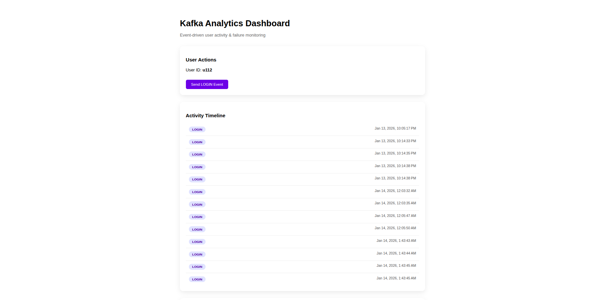
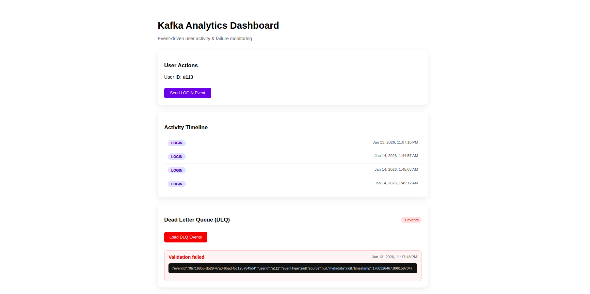

# Analytics Dashboard (Frontend)

An Angular-based dashboard for visualizing real-time analytics and Dead Letter Queue (DLQ) events produced by a Kafka-powered backend system.

This UI focuses on clarity, observability, and clean visualization of event-driven data.

---

## Overview

The frontend allows users to:
- Trigger Kafka events
- View processed analytics data
- Inspect DLQ events
- Understand system behavior visually

This project complements the Kafka backend and completes the end-to-end data flow.

---

## UI Features

- Trigger user activity events
- View analytics stored in MongoDB
- View DLQ events
- Clean and readable dashboard layout
- Simple and focused UI design

---

##  Dashboard Preview

  

  

---

## Tech Stack

- Angular (Standalone Components)
- TypeScript
- CSS

---

# Backend Repository

This frontend consumes data from the Kafka-based backend:
- https://github.com/04Marsha/Kafka-based-Analytics-Dashboard-Backend

--- 

